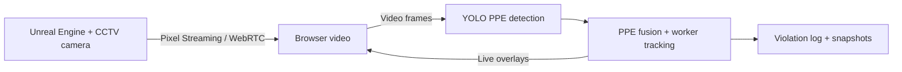
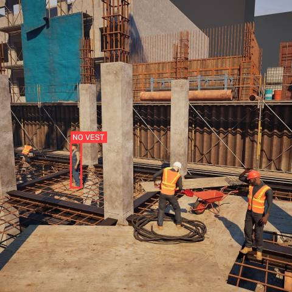
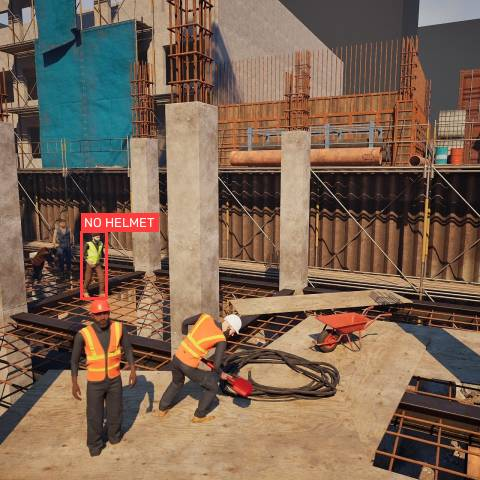

Unreal Engine 5.8 project for a synthetic construction-site PPE monitoring demo.

```mermaid
flowchart LR
    U[Unreal Engine + CCTV camera] -->|Pixel Streaming / WebRTC| B[Browser video]
    B -->|Video frames| Y[YOLO PPE detection]
    Y --> T[PPE fusion + worker tracking]
    T -->|Live overlays| B
    T --> L[Violation log + snapshots]
```

